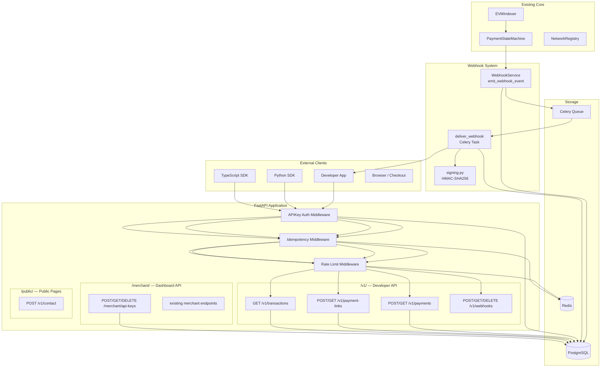
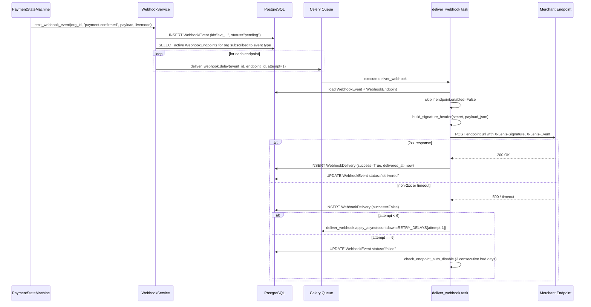

# Design Document: Developer API & Public Platform

## Overview

This document describes the technical design for three major additions to the Lenis platform:

1. **Developer API (`/v1/`)** — A production-grade versioned REST API authenticated by API keys, with idempotency, per-key rate limiting, and test/live mode isolation. Developers can create payments, manage payment links, query transactions, and register webhooks without touching the merchant dashboard.

2. **Webhooks System** — A signed, retried, auditable outbound event delivery pipeline. Every payment state transition emits a `WebhookEvent` record, delivers it to all subscribed `WebhookEndpoint` records via Celery tasks, and retries on failure with exponential backoff.

3. **Public Platform** — React-based public pages (homepage, pricing, about, docs, terms, privacy, contact) served from the existing React frontend, with a `/v1/contact` POST endpoint handled by FastAPI.

The design reuses all existing modules — `app/core/models.py` (User, Organization, APIKey, Payment, PaymentLink), `app/core/security.py`, `app/core/networks.py`, `app/web3/state_machine.py`, and `app/core/celery_app.py` — adding three new app modules and extending two existing models.

---

## Architecture

### System Overview



### Request Lifecycle for `/v1/*`

```
HTTP Request
    │
    ▼
APIKeyAuthMiddleware  (FastAPI dependency: get_api_key_org)
    │  Extract Bearer token → SHA-256 → lookup api_keys.key_hash
    │  Attach: request.state.organization, .user, .test_mode, .api_key_id
    ▼
IdempotencyMiddleware (wraps handler)
    │  If Idempotency-Key header present:
    │    Check Redis key: idempotency:{api_key_id}:{sha256(ik)}
    │    HIT → return cached response + Idempotency-Replayed: true
    │    MISS → proceed; after 2xx → cache in Redis (TTL=86400s)
    ▼
RateLimitMiddleware  (per-API-key sliding window in Redis)
    │  Key: ratelimit:{api_key_id}:{window_minute}
    │  Exceeds limit → HTTP 429 + Retry-After
    │  Sets X-RateLimit-* headers on all responses
    ▼
Route Handler
    │  Reads request.state.test_mode
    │  Business logic in app/developer/service.py
    ▼
Response + X-Request-ID header
```

---

## Components and Interfaces

### File Structure

```
app/
├── developer/
│   ├── __init__.py
│   ├── auth.py          # get_api_key_org dependency
│   ├── middleware.py    # IdempotencyMiddleware, APIKeyRateLimitMiddleware
│   ├── router.py        # all /v1/* routes + /merchant/api-keys routes
│   ├── schemas.py       # Pydantic request/response models
│   └── service.py       # business logic (payments, payment links, transactions, api keys)
│
├── webhooks/
│   ├── __init__.py
│   ├── delivery.py      # Celery tasks: deliver_webhook, retry schedule
│   ├── router.py        # /v1/webhooks CRUD + test endpoint
│   ├── schemas.py
│   ├── service.py       # emit_webhook_event, endpoint management
│   └── signing.py       # compute_signature, build_signature_header, verify_signature
│
├── public/
│   ├── __init__.py
│   ├── router.py        # POST /v1/contact
│   └── schemas.py       # ContactFormRequest, ContactFormResponse
│
sdks/
├── python/              # lenis-python SDK
│   ├── lenis/
│   │   ├── __init__.py
│   │   ├── client.py
│   │   ├── exceptions.py
│   │   ├── models.py
│   │   ├── _http.py
│   │   └── resources/
│   │       ├── payments.py
│   │       ├── payment_links.py
│   │       └── webhooks.py
│   ├── tests/
│   │   └── test_client.py
│   ├── pyproject.toml
│   └── README.md
│
└── typescript/          # lenis-node SDK
    ├── src/
    │   ├── index.ts
    │   ├── client.ts
    │   ├── errors.ts
    │   ├── types.ts
    │   └── resources/
    │       ├── payments.ts
    │       ├── paymentLinks.ts
    │       └── webhooks.ts
    ├── tests/
    │   └── client.test.ts
    ├── package.json
    ├── tsconfig.json
    └── README.md
```

### `app/developer/auth.py` — API Key Dependency

```python
async def get_api_key_org(request: Request, db: AsyncSession) -> tuple[Organization, User, str]:
    """
    FastAPI dependency injected into all /v1/* handlers.
    
    1. Extracts Bearer token from Authorization header.
    2. Validates format: must be sk_test_* or sk_live_* with >= 32 char suffix.
    3. SHA-256 hashes the token, looks up api_keys.key_hash.
    4. Checks active=True, not expired.
    5. Sets request.state.test_mode, .organization, .user, .api_key_id.
    6. Returns (organization, user, api_key_id).
    
    Raises HTTPException 401 on any auth failure.
    """
```

### `app/developer/middleware.py` — Idempotency & Rate Limiting

```python
class IdempotencyMiddleware:
    """
    Wraps POST handler execution.
    
    Redis key: idempotency:{api_key_id}:{sha256(idempotency_key_value)}
    Stored value JSON: {status_code, body, endpoint, body_hash}
    TTL: 86400 seconds
    
    Rules:
    - Empty or >255 char Idempotency-Key → HTTP 422
    - Cache miss: execute handler, store 2xx response
    - Cache hit, same endpoint+body_hash: return cached + Idempotency-Replayed: true
    - Cache hit, different endpoint or body_hash: HTTP 422 idempotency_key_reused_with_different_request
    """

class APIKeyRateLimitMiddleware:
    """
    Sliding window rate limiter keyed by API key ID.
    
    Redis keys:
      ratelimit:{api_key_id}:{current_window_minute}  → count
      ratelimit:{api_key_id}:{previous_window_minute} → count
    
    Sliding window approximation:
      elapsed_fraction = (current_second_in_minute) / 60
      effective_count = prev_count * (1 - elapsed_fraction) + curr_count
    
    On exceed: HTTP 429 + Retry-After header
    Always sets: X-RateLimit-Limit, X-RateLimit-Remaining, X-RateLimit-Reset
    On Redis failure: fail-open, omit X-RateLimit-* headers
    """
```

### `app/webhooks/signing.py` — HMAC Signatures

```python
def compute_signature(secret: str, timestamp: int, payload_json: str) -> str:
    """HMAC-SHA256 over f"t={timestamp}\n{payload_json}" using secret."""
    message = f"t={timestamp}\n{payload_json}"
    return hmac.new(secret.encode(), message.encode(), hashlib.sha256).hexdigest()

def build_signature_header(secret: str, payload_json: str) -> tuple[str, int]:
    """Returns (header_value, timestamp) where header = 't={ts},v1={hex}'."""
    ts = int(time.time())
    sig = compute_signature(secret, ts, payload_json)
    return f"t={ts},v1={sig}", ts

def verify_signature(payload_bytes: bytes, sig_header: str, secret: str, tolerance_seconds: int = 300) -> dict:
    """
    Verifies X-Lenis-Signature header.
    Raises LenisWebhookSignatureError on:
      - Missing or malformed header (no 'v1=' component)
      - Timestamp older than tolerance_seconds from now
      - HMAC mismatch
    Returns parsed event dict on success.
    """
```

### `app/webhooks/service.py` — Event Emission

```python
async def emit_webhook_event(
    db: AsyncSession,
    organization_id: uuid.UUID,
    event_type: str,
    payload_data: dict,
    livemode: bool,
) -> WebhookEvent:
    """
    1. Creates WebhookEvent record (append-only) — id format: "evt_{28-hex}"
    2. Queries WebhookEndpoints where organization_id=org AND enabled=True
       AND event_type in endpoint.events
    3. For each endpoint: enqueues deliver_webhook.delay(event_id, endpoint_id)
    4. Returns the persisted WebhookEvent

    On DB error persisting WebhookEvent: logs error with event_type + org_id,
    does NOT attempt delivery.
    """
```

### `app/webhooks/delivery.py` — Celery Delivery Task

```python
RETRY_DELAYS = [5, 30, 300, 1800, 7200]  # seconds between attempts 1-2, 2-3, 3-4, 4-5, 5-6

@celery_app.task(bind=True, name="app.webhooks.delivery.deliver_webhook", max_retries=5)
def deliver_webhook(self, event_id: str, endpoint_id: str, attempt: int = 1) -> None:
    """
    1. Load WebhookEvent + WebhookEndpoint
    2. Skip if endpoint.enabled is False (no WebhookDelivery row created)
    3. Build payload JSON, compute signature header
    4. POST to endpoint.url with 30s timeout
    5. Record WebhookDelivery row with all fields
    6. On success (2xx): done
    7. On failure: schedule next attempt with countdown=RETRY_DELAYS[attempt-1]
                   if attempt < 6, else mark event as 'failed'
    8. After recording: check_endpoint_auto_disable(endpoint_id)
    """
```

---

## Data Models

### New SQLAlchemy Models (additions to `app/core/models.py`)

#### WebhookEndpoint

```python
class WebhookEndpoint(Base):
    __tablename__ = "webhook_endpoints"
    __table_args__ = (
        Index("idx_webhook_endpoints_org", "organization_id"),
        CheckConstraint("url LIKE 'https://%'", name="ck_webhook_endpoints_https"),
    )

    id: Mapped[uuid.UUID]             # PK, default=uuid4
    organization_id: Mapped[uuid.UUID] # FK → organizations(id) ondelete=CASCADE
    url: Mapped[str]                   # VARCHAR(2048), HTTPS only
    secret: Mapped[str]                # VARCHAR(64), plaintext 32-byte hex for HMAC
    events: Mapped[object]             # JSON, list[str] of event type names
    enabled: Mapped[bool]              # default=True
    disabled_at: Mapped[Optional[datetime]]  # set when auto-disabled after 3 bad days
    created_at: Mapped[datetime]
    updated_at: Mapped[datetime]
```

#### WebhookEvent (append-only)

```python
class WebhookEvent(Base):
    __tablename__ = "webhook_events"
    __table_args__ = (
        Index("idx_webhook_events_org", "organization_id"),
        Index("idx_webhook_events_type", "type"),
        Index("idx_webhook_events_created", "created_at"),
        # status column for lifecycle tracking
        CheckConstraint(
            "status IN ('pending','delivered','failed')",
            name="ck_webhook_events_status",
        ),
    )

    id: Mapped[str]                    # VARCHAR(32) PK, "evt_" + 28 hex chars
    organization_id: Mapped[uuid.UUID] # FK → organizations(id)
    type: Mapped[str]                  # VARCHAR(100), e.g. "payment.confirmed"
    payload: Mapped[object]            # JSON — full event envelope
    livemode: Mapped[bool]             # False for test-mode events
    status: Mapped[str]                # 'pending'|'delivered'|'failed', default='pending'
    created_at: Mapped[datetime]

    # AppendOnlyMixin not used here to allow status updates;
    # direct DB UPDATE for status field is the only mutation permitted.
```

**Note**: `WebhookEvent` is "append-only" in the sense that rows are never deleted, but `status` must be updatable (pending → delivered/failed). The restriction is enforced at the application layer by never exposing DELETE/UPDATE routes for this table.

#### WebhookDelivery

```python
class WebhookDelivery(Base):
    __tablename__ = "webhook_deliveries"
    __table_args__ = (
        Index("idx_webhook_deliveries_endpoint", "endpoint_id"),
        Index("idx_webhook_deliveries_event", "event_id"),
        Index("idx_webhook_deliveries_created", "created_at"),
    )

    id: Mapped[uuid.UUID]              # PK, default=uuid4
    endpoint_id: Mapped[uuid.UUID]     # FK → webhook_endpoints(id) ondelete=CASCADE
    event_id: Mapped[str]              # FK → webhook_events(id)
    status_code: Mapped[Optional[int]] # HTTP response status, null on timeout
    response_body: Mapped[Optional[str]] # TEXT, first 4096 bytes of response
    duration_ms: Mapped[Optional[int]] # request round-trip time in milliseconds
    attempt_number: Mapped[int]        # 0=test, 1=first real, 2-6=retries
    success: Mapped[bool]              # True if 2xx received
    delivered_at: Mapped[Optional[datetime]]  # set on success
    created_at: Mapped[datetime]
```

### Modifications to Existing Models

#### Payment (additions)

```python
# Add to existing Payment model in app/core/models.py:
is_test: Mapped[bool]                     # default=False; True for sk_test_* created records
metadata_json: Mapped[Optional[object]]   # JSON, developer-supplied metadata (max 16 keys)
organization_id: Mapped[Optional[uuid.UUID]]  # FK → organizations(id), nullable for backward compat
```

#### PaymentLink (additions)

```python
# Add to existing PaymentLink model:
is_test: Mapped[bool]                     # default=False
external_id: Mapped[Optional[str]]        # VARCHAR(128), developer reference field
organization_id: Mapped[Optional[uuid.UUID]]  # FK → organizations(id), nullable
```

**Migration**: A new Alembic revision file adds the three webhook tables, `is_test` / `metadata_json` / `organization_id` columns on `payments`, and `is_test` / `external_id` / `organization_id` on `payment_links`. SQLite auto-migration in `main.py` lifespan will also add these columns on dev startup.

### Supported Webhook Event Types

| Event Type | Trigger |
|---|---|
| `payment.created` | `POST /v1/payments` creates a Payment record |
| `payment.detected` | `PaymentStateMachine.record_detected_payment` called |
| `payment.confirming` | Payment transitions to `confirming` status |
| `payment.confirmed` | Payment transitions to `confirmed` status |
| `payment.expired` | `PaymentStateMachine.expire_payment` called |
| `payment.underpaid` | Payment transitions to `underpaid` status |
| `payment.link.created` | `POST /v1/payment-links` or merchant creates link |
| `payment.link.deactivated` | Payment link status set to `inactive` |

---

## API Endpoint Table

### Merchant Dashboard Additions (`/merchant/`)

| Method | Path | Auth | Description |
|---|---|---|---|
| `POST` | `/merchant/api-keys` | JWT Merchant | Create API key; returns plaintext once |
| `GET` | `/merchant/api-keys` | JWT Merchant | List active keys (masked) |
| `DELETE` | `/merchant/api-keys/{key_id}` | JWT Merchant | Revoke API key |

### Developer API (`/v1/`)

All `/v1/*` endpoints are authenticated via `Authorization: Bearer sk_test_*` or `sk_live_*`.

| Method | Path | Description |
|---|---|---|
| `POST` | `/v1/payments` | Create payment intent |
| `GET` | `/v1/payments` | List payments (paginated, filterable) |
| `GET` | `/v1/payments/{id}` | Retrieve payment |
| `POST` | `/v1/payment-links` | Create payment link |
| `GET` | `/v1/payment-links` | List payment links (paginated) |
| `GET` | `/v1/payment-links/{id}` | Retrieve payment link |
| `GET` | `/v1/transactions` | List confirmed transactions |
| `GET` | `/v1/transactions/{id}` | Retrieve confirmed transaction |
| `POST` | `/v1/webhooks` | Register webhook endpoint |
| `GET` | `/v1/webhooks` | List webhook endpoints |
| `DELETE` | `/v1/webhooks/{id}` | Delete webhook endpoint |
| `GET` | `/v1/webhooks/{id}/deliveries` | List delivery attempts |
| `POST` | `/v1/webhooks/{id}/test` | Fire synthetic test delivery |

### Public Endpoints

| Method | Path | Auth | Description |
|---|---|---|---|
| `POST` | `/v1/contact` | None | Submit contact form |

### Pydantic Schemas (key shapes)

**PaymentIntentRequest**
```python
class PaymentIntentRequest(BaseModel):
    amount: Decimal                    # 0.01 – 999,999,999.99, max 8 dp
    token_symbol: str
    network: str
    accepted_tokens: list[AcceptedTokenEntry]  # min 1
    customer_email: Optional[str]      # max 254 chars, RFC 5322
    redirect_url: Optional[str]        # HTTPS, max 2048 chars
    expires_in: int = 3600             # 300–86400 seconds
    metadata: Optional[dict]           # max 16 keys, vals max 500 chars
    idempotency_key: None = None       # passed via header, not body
```

**PaymentIntentResponse**
```python
class PaymentIntentResponse(BaseModel):
    id: str
    status: str
    amount: Decimal
    token_symbol: str
    network: str
    checkout_url: str
    created: int           # Unix timestamp
    expires_at: int        # Unix timestamp
    is_test: bool
    livemode: bool
```

**ListResponse (generic shape for all list endpoints)**
```python
class ListResponse(BaseModel, Generic[T]):
    data: list[T]
    has_more: bool
    next_cursor: Optional[str]
    total: Optional[int]
```

**ErrorResponse (all error shapes)**
```python
class ErrorResponse(BaseModel):
    error: str             # machine-readable code
    message: str           # human-readable description
    param: Optional[str]   # field name for validation errors
```

---

## Webhook Delivery Flow



### Auto-disable Logic

`check_endpoint_auto_disable(endpoint_id)` runs after every failed delivery. It queries WebhookDelivery rows for the endpoint grouped by calendar day. If the last 3 distinct calendar days all have zero successful deliveries, it sets `WebhookEndpoint.enabled = False` and records `disabled_at`.

---

## SDK Architecture

### Python SDK (`sdks/python/`)

```
LenisClient(api_key: str)
├── .payments          → PaymentsResource
│   ├── .create(**kwargs)           → PaymentIntent
│   ├── .retrieve(payment_id)       → PaymentIntent
│   └── .list(**filters)            → ListObject[PaymentIntent]
├── .payment_links     → PaymentLinksResource
│   ├── .create(**kwargs)           → PaymentLink
│   ├── .retrieve(id)               → PaymentLink
│   └── .list(**filters)            → ListObject[PaymentLink]
└── .webhooks          → WebhooksResource
    └── .construct_event(payload, sig_header, secret) → dict
```

**`_http.py`** wraps `httpx.AsyncClient` (sync adapter also provided) with:
- Base URL: configurable, default `https://api.lenis.io`
- Retry on 5xx: delays `[1, 2, 4]` seconds, max 3 retries before raising `LenisAPIError`
- 30-second request timeout
- Raises `LenisAuthError` (HTTP 401), `LenisAPIError` (any other non-2xx)

**Exceptions**:
```python
class LenisAuthError(Exception):       # HTTP 401, or api_key is None/empty
    status_code: int
    error: str

class LenisAPIError(Exception):        # non-2xx, non-401
    status_code: int
    error: str
    param: Optional[str]

class LenisWebhookSignatureError(Exception):  # HMAC verification failure
    message: str
```

### TypeScript SDK (`sdks/typescript/`)

```typescript
class Lenis {
  constructor({ apiKey }: { apiKey: string })
  payments: PaymentsResource
  paymentLinks: PaymentLinksResource
  webhooks: WebhooksResource
}

interface PaymentsResource {
  create(params: CreatePaymentParams): Promise<PaymentIntent>
  retrieve(paymentId: string): Promise<PaymentIntent>
  list(params?: ListPaymentsParams): Promise<ListObject<PaymentIntent>>
}
```

- Builds on the Node.js `https` module (no external HTTP dep) or `fetch` for browser compatibility
- Retry on 5xx: delays `[1000, 2000, 4000]` ms, max 3 retries
- Exports both ESM (`dist/esm/`) and CJS (`dist/cjs/`) via `tsconfig.json` dual build
- Throws `LenisAuthError`, `LenisAPIError`, `LenisWebhookSignatureError`
- All request/response types exported from `src/types.ts`

---

## Public Pages Architecture

The public pages are implemented in the existing React frontend (`frontend/src/pages/public/`). FastAPI serves a single new REST endpoint for the contact form; all static page content lives in React components.

### New React Routes

| Path | Component | Description |
|---|---|---|
| `/` | `HomePage` | Hero, features, networks, pricing CTA |
| `/about` | `AboutPage` | Platform mission, non-custodial model |
| `/pricing` | `PricingPage` | Three-tier feature matrix |
| `/terms` | `TermsPage` | Terms & Conditions |
| `/privacy` | `PrivacyPage` | Privacy Policy |
| `/contact` | `ContactPage` | Contact form (POST to `/v1/contact`) |
| `/docs` | `DocsLayout` | Sidebar + content router |
| `/docs/getting-started` | `GettingStartedDocs` | |
| `/docs/api-reference/payments` | `PaymentsDocs` | |
| `/docs/api-reference/webhooks` | `WebhooksDocs` | |
| `/docs/sdks` | `SDKsDocs` | |

### Docs Hub Sidebar Structure

```
Getting Started
  ├── Introduction
  ├── Quickstart
  ├── Authentication
  └── Test Mode vs Live Mode

Core Concepts
  ├── Non-Custodial Model
  ├── Payment Lifecycle
  ├── Supported Networks & Tokens
  └── Idempotency Keys

API Reference
  ├── Payments
  ├── Payment Links
  ├── Transactions
  ├── Webhooks
  └── API Keys

Webhooks
  ├── Setup Guide
  ├── Event Types
  ├── Signature Verification
  └── Retry Logic

SDKs
  ├── Python SDK
  └── TypeScript SDK

Integration Guides
  ├── E-Commerce Integration
  ├── Custom Checkout Flow
  └── Webhook Handler Setup

Security
  ├── API Key Best Practices
  ├── Webhook Signature Verification
  └── Idempotency Key Usage
```

### Contact Form Backend (`app/public/router.py`)

```python
@router.post("/v1/contact")
async def submit_contact_form(data: ContactFormRequest) -> ContactFormResponse:
    """
    Validates: name 1-100 chars, valid email, message 1-2000 chars.
    On valid: enqueues email to settings.smtp_from_address via Celery.
    On invalid: HTTP 422 with field-level error.
    Returns: HTTP 200 {"success": True, "message": "..."}
    """
```

---

## Correctness Properties

*A property is a characteristic or behavior that should hold true across all valid executions of a system — essentially, a formal statement about what the system should do. Properties serve as the bridge between human-readable specifications and machine-verifiable correctness guarantees.*

### Property 1: API Key Hash Integrity

*For any* API key created via `POST /merchant/api-keys`, the stored `key_hash` in the database MUST equal `sha256(plaintext_key)` and the full plaintext key MUST NOT be stored anywhere in the `api_keys` table.

**Validates: Requirements 1.2**

---

### Property 2: Organization Isolation

*For any* two distinct organizations A and B with their respective API keys, a Developer API list or retrieve request authenticated with org A's key MUST never return a resource (Payment, PaymentLink, or WebhookEndpoint) whose `organization_id` equals B's id.

**Validates: Requirements 6.1, 6.2, 7.2, 7.3, 8.2, 8.3**

---

### Property 3: Test/Live Mode Isolation

*For any* payment or payment link created using a `sk_test_*` key (tagged `is_test=True`), retrieving or listing it with a `sk_live_*` key MUST return HTTP 404. Conversely, *for any* record created with a `sk_live_*` key (`is_test=False`), it MUST never appear in a `sk_test_*` key's list response.

**Validates: Requirements 16.3, 16.4, 16.6**

---

### Property 4: Idempotency Record Invariant

*For any* POST request to a `/v1/*` endpoint with a fixed `Idempotency-Key` header, sending the same request N times (N ≥ 1, same body, same API key) MUST result in exactly 1 database record being created (not N), and all N responses MUST have identical HTTP status codes and response bodies.

**Validates: Requirements 4.1, 4.2**

---

### Property 5: Webhook Signature Round-Trip

*For any* payload string and secret string, calling `compute_signature(secret, ts, payload)` to produce a signature header and then calling `verify_signature(payload.encode(), header, secret)` MUST succeed without raising any exception. *For any* different secret `secret_b ≠ secret_a`, calling `verify_signature(payload.encode(), build_signature_header(secret_a, payload)[0], secret_b)` MUST always raise `LenisWebhookSignatureError`.

**Validates: Requirements 13.1, 13.2, 13.3, 13.4**

---

### Property 6: Webhook Delivery Audit Completeness

*For any* WebhookEvent ID, the count of `WebhookDelivery` rows with `event_id` equal to that ID MUST equal the total number of delivery attempts that were made for that event (including retries).

**Validates: Requirements 12.4, 12.5, 12.6**

---

### Property 7: Rate Limit Enforcement

*For any* API key at the default tier, making exactly 101 requests within a single 60-second sliding window MUST result in the 101st request receiving HTTP 429, and all 100 prior requests receiving non-429 responses.

**Validates: Requirements 3.1, 3.3**

---

### Property 8: API Key Masking Invariant

*For any* list of active API keys returned by `GET /merchant/api-keys`, every object in the response array MUST contain `prefix` and `suffix_display` but MUST NOT contain any field whose value equals the full plaintext secret key or its SHA-256 hash.

**Validates: Requirements 1.4**

---

## Error Handling

All `/v1/*` endpoints return errors in the unified shape:
```json
{
  "error": "<machine_readable_code>",
  "message": "<human_readable_description>",
  "param": "<field_name_or_null>"
}
```

Every `/v1/*` response also includes `X-Request-ID: <uuid>` and `Content-Type: application/json`.

### Error Code Reference

| HTTP Status | Error Code | Trigger |
|---|---|---|
| 400 | `invalid_request` | Non-JSON request body |
| 401 | `invalid_api_key` | Missing/invalid API key |
| 401 | `api_key_revoked` | Key is active=False |
| 401 | `api_key_expired` | Key expires_at is in the past |
| 404 | `payment_not_found` | Wrong org, wrong mode, or nonexistent |
| 404 | `payment_link_not_found` | Wrong org or nonexistent |
| 404 | `transaction_not_found` | Wrong org, not confirmed/paid, or nonexistent |
| 404 | `webhook_not_found` | Wrong org or nonexistent |
| 422 | `invalid_amount` | Amount out of range or invalid format |
| 422 | `unsupported_network` | Network not in NetworkRegistry |
| 422 | `unsupported_token` | Token not available on given network |
| 422 | `invalid_expires_in` | Value outside 300–86400 |
| 422 | `invalid_filter` | Malformed query filter value |
| 422 | `api_key_limit_reached` | Org already has 10 active keys |
| 422 | `webhook_endpoint_limit_reached` | Org already has 20 endpoints |
| 422 | `webhook_url_must_be_https` | URL does not start with https:// |
| 422 | `unrecognized_event_types` | Unknown event type in events array |
| 422 | `idempotency_key_reused_with_different_request` | Same key, different body/endpoint |
| 422 | `invalid_idempotency_key` | Empty or >255 chars |
| 429 | `rate_limit_exceeded` | Sliding window exceeded |

### Webhook Delivery Errors

- Network errors, DNS failures, and connection timeouts (30s) all count as failed attempts.
- Response body truncated to first 4096 bytes before storage.
- Endpoints auto-disabled after 3 consecutive calendar days of all-failed deliveries.
- Failed events (all 6 attempts exhausted) are flagged in `WebhookEvent.status = "failed"` for operator review.

---

## Testing Strategy

### Unit Tests

Unit tests are co-located in each module's `tests/` directory and use `pytest` with `pytest-asyncio` and `unittest.mock`.

Focus areas:
- `app/developer/auth.py`: valid key auth, revoked key 401, expired key 401, wrong format 401, test_mode flag set correctly
- `app/developer/middleware.py`: idempotency cache hit/miss, body hash mismatch 422, rate limit sliding window logic
- `app/developer/service.py`: amount validation, network/token validation, is_test tagging, org isolation filters
- `app/webhooks/signing.py`: signature generation, verification success, verification failure, timestamp tolerance
- `app/webhooks/service.py`: event emission with DB error handling, endpoint filtering by event type
- `app/webhooks/delivery.py`: retry schedule, delivery row creation, auto-disable check
- `sdks/python/tests/test_client.py`: payment creation, idempotency replay, 401 → LenisAuthError, signature success/failure

### Property-Based Tests

Property-based tests use `hypothesis` (Python) and `fast-check` (TypeScript). Each runs a minimum of 100 iterations.

**Python (hypothesis)**:

```python
# Feature: developer-api-and-public-platform, Property 1: API Key Hash Integrity
@given(key_type=st.sampled_from(["sk_test", "pk_test", "sk_live", "pk_live"]))
def test_api_key_hash_integrity(key_type):
    """Generated key_hash must equal sha256(plaintext). Plaintext not in DB."""

# Feature: developer-api-and-public-platform, Property 4: Idempotency Record Invariant
@given(idempotency_key=st.text(min_size=1, max_size=255), n=st.integers(min_value=2, max_value=10))
def test_idempotency_record_invariant(idempotency_key, n):
    """Sending same POST N times creates exactly 1 DB record."""

# Feature: developer-api-and-public-platform, Property 5: Webhook Signature Round-Trip
@given(payload=st.text(), secret=st.text(min_size=1))
def test_webhook_signature_roundtrip(payload, secret):
    """verify(sign(payload, secret), payload, secret) always succeeds."""

@given(payload=st.text(), secret_a=st.text(min_size=1), secret_b=st.text(min_size=1))
def test_webhook_signature_wrong_secret(payload, secret_a, secret_b):
    """If secret_a != secret_b, verify with secret_b always raises."""
    assume(secret_a != secret_b)
    with pytest.raises(LenisWebhookSignatureError):
        verify_signature(...)

# Feature: developer-api-and-public-platform, Property 2: Organization Isolation
@given(org_a_payments=st.lists(payment_strategy()), org_b_payments=st.lists(payment_strategy()))
def test_org_isolation(org_a_payments, org_b_payments):
    """No payment from org B appears in org A list response."""

# Feature: developer-api-and-public-platform, Property 3: Test/Live Mode Isolation
@given(payment=payment_strategy())
def test_test_live_isolation(payment):
    """sk_test payment never retrievable with sk_live key and vice versa."""
```

**TypeScript (fast-check)**:

```typescript
// Feature: developer-api-and-public-platform, Property 5: Webhook Signature Round-Trip
it("webhook signature round-trip", () => {
  fc.assert(fc.property(
    fc.string(), fc.string({ minLength: 1 }),
    (payload, secret) => {
      const [header] = buildSignatureHeader(secret, payload);
      expect(() => constructEvent(Buffer.from(payload), header, secret)).not.toThrow();
    }
  ), { numRuns: 100 });
});
```

### Integration Tests

Integration tests run against a live SQLite test database using `pytest-asyncio` and `httpx.AsyncClient`:
- Full request lifecycle for `/v1/payments` create → retrieve
- Webhook delivery chain: emit event → Celery task (eager mode) → delivery row created
- Auto-disable logic: mock 3 days of consecutive failures
- Contact form: valid submission sends email (mock SMTP), invalid returns 422

---

## Migration Strategy

A new Alembic migration file handles all schema additions for this feature:

**Revision filename**: `{hash}_add_developer_api_and_webhooks.py`

**Operations**:
1. `CREATE TABLE webhook_endpoints` with all columns and indexes
2. `CREATE TABLE webhook_events` with all columns and indexes
3. `CREATE TABLE webhook_deliveries` with all columns and indexes
4. `ALTER TABLE payments ADD COLUMN is_test BOOLEAN NOT NULL DEFAULT FALSE`
5. `ALTER TABLE payments ADD COLUMN metadata_json JSON`
6. `ALTER TABLE payments ADD COLUMN organization_id UUID REFERENCES organizations(id)`
7. `ALTER TABLE payment_links ADD COLUMN is_test BOOLEAN NOT NULL DEFAULT FALSE`
8. `ALTER TABLE payment_links ADD COLUMN external_id VARCHAR(128)`
9. `ALTER TABLE payment_links ADD COLUMN organization_id UUID REFERENCES organizations(id)`
10. Create index `idx_payments_is_test`, `idx_payments_org`, `idx_payment_links_is_test`, `idx_payment_links_org`

**Downgrade**: drops all three new tables, drops the added columns (PostgreSQL supports `DROP COLUMN`; SQLite downgrade is a no-op with a comment noting manual rollback required).

**SQLite dev auto-migration**: The `lifespan` handler in `app/main.py` already contains the `_sync_sqlite_cols` pattern. The new columns (`is_test`, `metadata_json`, `organization_id` on payments; `is_test`, `external_id`, `organization_id` on payment_links) should be added to `add_p_cols` and `add_pl_cols` dictionaries respectively.

**Celery include list**: `app/core/celery_app.py` must add `"app.webhooks.delivery"` to the `include` list to register the `deliver_webhook` task.

**Router registration**: `app/main.py` must add three `_include_router_if_available` calls for `app.developer.router`, `app.webhooks.router`, and `app.public.router`.
