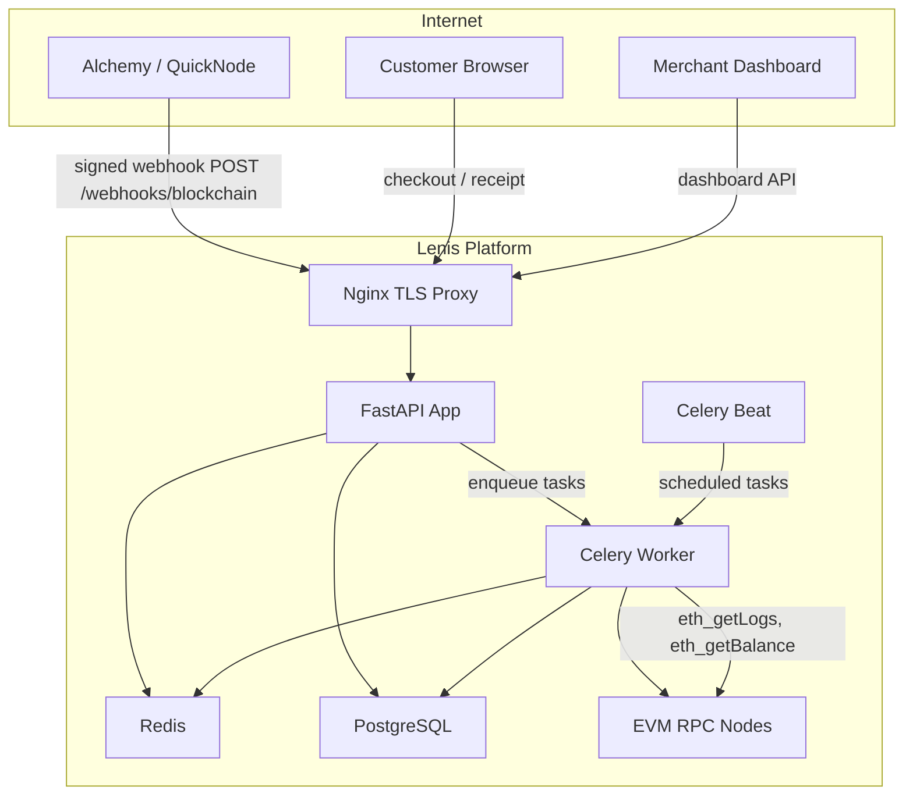
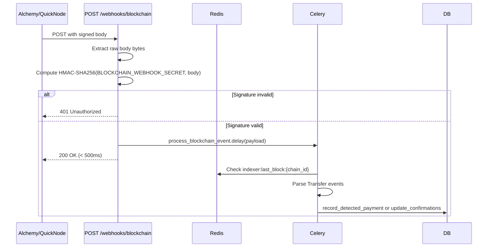
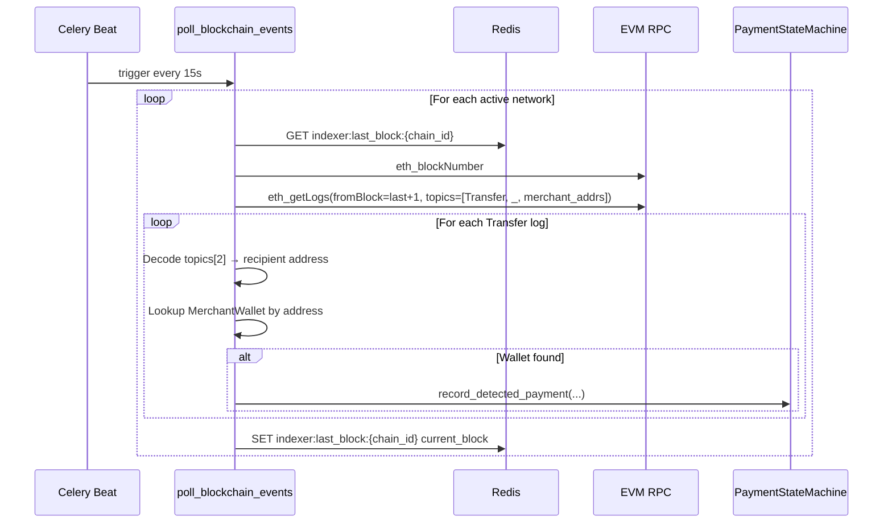
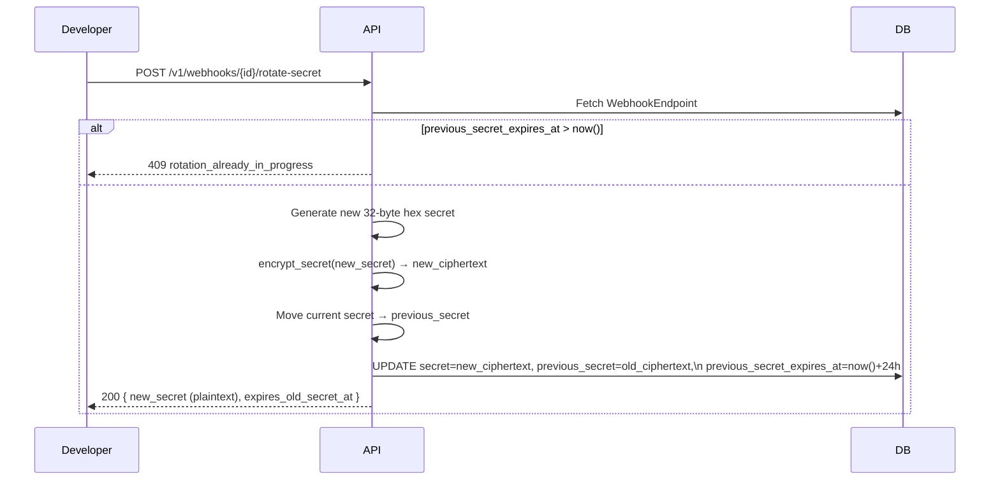
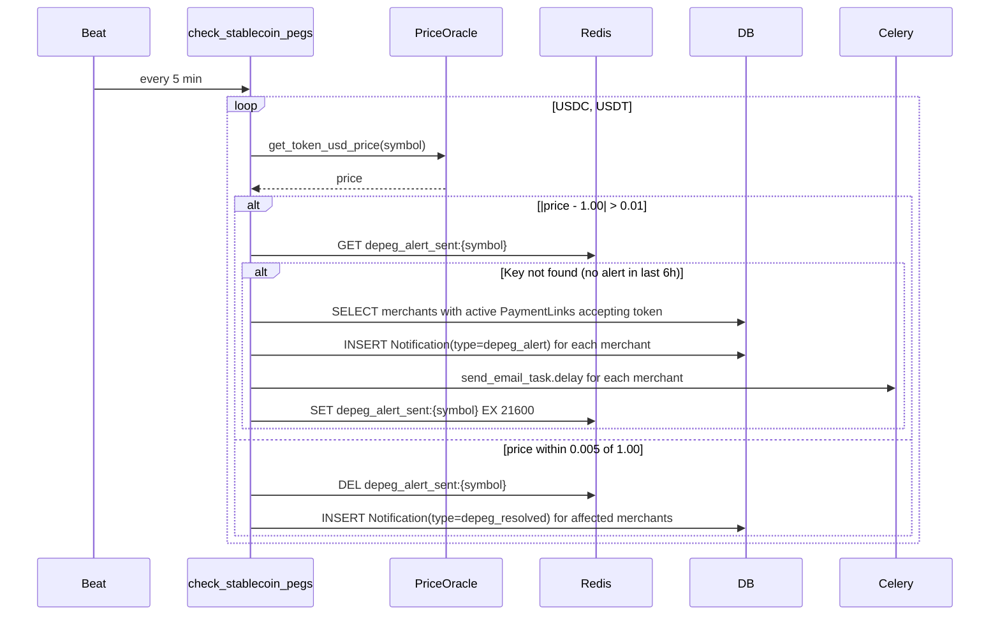

# Design Document — Production-Ready Platform

## Overview

This document describes the technical design for hardening the Lenis Web3 Financial Infrastructure SaaS from a functional development build into a production-deployable, observable, and commercially complete platform. The work spans 26 requirements across four groups: Critical Blockers, Security Hardening, Operational Concerns, and New Product Features.

The existing system is a FastAPI 0.115 + SQLAlchemy 2.0 async backend (Python 3.12) backed by PostgreSQL (asyncpg), Redis (5.2), and Celery (5.4) workers. The platform processes EVM-chain cryptocurrency payments across six networks (Ethereum, Base, Polygon, Arbitrum One, Optimism, BSC) without custodying funds.

This design preserves all existing module boundaries and extends them incrementally rather than restructuring the project.

---

## Architecture

### High-Level Component Map



### New Modules Summary

| Path | Purpose |
|---|---|
| `app/web3/indexer.py` | Blockchain indexer (webhook + polling modes) |
| `app/webhooks/crypto.py` | AES-256-GCM encryption for webhook secrets |
| `app/core/price_oracle.py` | CoinGecko price fetch with Redis cache |
| `app/core/tier_limits.py` | Subscription tier limit constants |
| `app/core/logging_config.py` | JSON structured logging setup |
| `app/merchant/balances.py` | On-chain balance fetch service |
| `frontend/src/routing/AdminRoute.tsx` | Admin-only route guard |
| `frontend/src/pages/ReceiptPage.tsx` | Public payment receipt |
| `frontend/src/pages/merchant/AnalyticsPage.tsx` | Merchant analytics chart |
| `migrations/versions/consolidate_inline_migrations.py` | Alembic migration for all new columns |

---

## Components and Interfaces

### 1. Blockchain Indexer (`app/web3/indexer.py`)

The indexer is the critical path for payment detection. It operates in two modes simultaneously: webhook push (Req 1) and RPC polling fallback (Req 2).

#### Webhook Mode — `POST /webhooks/blockchain`

```
POST /webhooks/blockchain
Headers: X-Alchemy-Signature | X-QN-Signature
Body: provider-specific JSON payload
Response: 200 OK within 500ms (Req 1.7)
```

The endpoint lives in a new `app/web3/router.py` and is wired into `app/main.py`.

**HMAC validation flow:**



Key design decisions:
- The endpoint reads the raw body **before** JSON parsing to compute the HMAC over the exact bytes the provider signed.
- All state-machine calls are dispatched to `process_blockchain_event` Celery task, keeping the HTTP handler under 500ms.
- Retry schedule: 5s, 30s, 300s (3 retries maximum per Req 1.8).

```python
# app/web3/router.py — new file
@router.post("/webhooks/blockchain", status_code=200)
async def receive_blockchain_webhook(
    request: Request,
    background_tasks: BackgroundTasks,
) -> dict:
    body_bytes = await request.body()
    _validate_provider_signature(body_bytes, request.headers)  # raises 401 on failure
    payload = json.loads(body_bytes)
    process_blockchain_event.delay(payload)
    return {"status": "accepted"}
```

**HMAC validation supports both providers:**
- Alchemy: `X-Alchemy-Signature` header contains HMAC-SHA256(BLOCKCHAIN_WEBHOOK_SECRET, raw_body)
- QuickNode: `X-QN-Signature` header with the same scheme

```python
# app/web3/indexer.py
def _validate_provider_signature(body: bytes, headers: Headers) -> None:
    secret = settings.blockchain_webhook_secret.encode()
    alchemy_sig = headers.get("X-Alchemy-Signature", "")
    qn_sig = headers.get("X-QN-Signature", "")
    expected = hmac.new(secret, body, hashlib.sha256).hexdigest()
    if not (
        (alchemy_sig and hmac.compare_digest(expected, alchemy_sig)) or
        (qn_sig and hmac.compare_digest(expected, qn_sig))
    ):
        raise HTTPException(status_code=401, detail="invalid_signature")
```

#### Polling Mode — `poll_blockchain_events` Celery Beat Task

Runs every 15 seconds when `INDEXER_POLLING_ENABLED=True`.

```python
# Celery beat schedule entry (added to celery_app.conf.beat_schedule)
"poll-blockchain-events": {
    "task": "app.web3.indexer.poll_blockchain_events",
    "schedule": 15.0,
}
```

**Algorithm:**



**Merchant wallet address loading:** The task loads all active `MerchantWallet` addresses at the start of each poll cycle and builds a lookup set. This set is used to filter `Transfer` log `topics[2]` values (zero-padded to 32 bytes).

**Duplicate detection:** Relies on the `UNIQUE` constraint on `payments.tx_hash`. The `record_detected_payment` method already handles the case where a payment with the given `tx_hash` already exists.

**Testnet routing:**

```python
def _get_rpc_url(network: NetworkConfig) -> str:
    if settings.testnet_mode:
        return TESTNET_RPC_MAP.get(network.chain_id, network.rpc_url)
    return network.rpc_url

TESTNET_RPC_MAP = {
    1: settings.ethereum_sepolia_rpc_url,
    8453: settings.base_sepolia_rpc_url,
    137: settings.polygon_mumbai_rpc_url,
    42161: settings.arbitrum_sepolia_rpc_url,
    10: settings.optimism_sepolia_rpc_url,
}
```

#### New Config Variables

```python
# Added to app/core/config.py Settings class
blockchain_webhook_secret: str = ""
indexer_polling_enabled: bool = False
webhook_encryption_key: str = ""  # base64-encoded 32 bytes
```

---

### 2. Idempotency Middleware Wiring (Req 3)

`IdempotencyMiddleware` already exists in `app/developer/middleware.py`. The only change is registering it in `app/main.py`:

```python
# app/main.py — inside create_app()
from app.developer.middleware import IdempotencyMiddleware, APIKeyRateLimitMiddleware
application.add_middleware(IdempotencyMiddleware)
application.add_middleware(APIKeyRateLimitMiddleware)
```

The existing `IdempotencyMiddleware` implementation already satisfies Req 3.1–3.6.

The `APIKeyRateLimitMiddleware` in `app/developer/middleware.py` needs one update for the enterprise tier multiplier (Req 4.5): after authenticating the API key, check `subscription_tier` on the owning organization's user and apply `RATE_LIMIT * 10` for enterprise. This requires a lightweight Redis-cached lookup of the tier by `key_id`.

```python
# Update to APIKeyRateLimitMiddleware.dispatch
TIER_MULTIPLIERS = {"enterprise": 10, "pro": 5, "growth": 2, "free": 1}

# After computing key_discriminator, fetch tier from Redis cache or DB
tier_key = f"api_key_tier:{key_discriminator}"
tier = await redis.get(tier_key) or "free"
effective_limit = self.RATE_LIMIT * TIER_MULTIPLIERS.get(tier, 1)
```

---

### 3. Live API Key Generation (Req 5)

New endpoint in `app/users/router.py`:

```
POST /users/me/api-keys/live
Auth: Bearer JWT (authenticated user, account_type = developer)
Response 200: { pk_live: str, sk_live_plaintext: str, sk_live_suffix: str }
Response 403: { error: "VERIFICATION_REQUIRED" }
Response 409: { error: "live_keys_already_exist" }
```

**Service logic (`app/users/service.py`):**

1. Assert `user.status == 'verified'` → 403 if not.
2. Query `APIKey` for existing `pk_live` or `sk_live` on the org → 409 if found.
3. Generate keys: `pk_live_{32-byte-hex}` and `sk_live_{32-byte-hex}`.
4. Hash `sk_live` with SHA-256; store `suffix_display = plaintext[-4:]`.
5. `pk_live` stored as plaintext (key_hash = SHA-256 of it for lookup).
6. Write `AuditLog(event_type='api_key.generate_live', actor_id=user.id, ...)`.
7. Return `sk_live` plaintext in response body — never again exposed.

---

### 4. CSP Tuning (Req 6)

`SecurityHeadersMiddleware` in `app/core/middleware.py` is updated to:

1. Generate a per-request nonce (`secrets.token_urlsafe(16)`).
2. Inject `request.state.csp_nonce` so templates can use it (for SSR scenarios).
3. Build a dynamic CSP string incorporating the nonce and per-env rules.

```python
class SecurityHeadersMiddleware(BaseHTTPMiddleware):
    async def dispatch(self, request: Request, call_next) -> Response:
        nonce = secrets.token_urlsafe(16)
        request.state.csp_nonce = nonce
        
        script_src = f"'self' 'nonce-{nonce}'"
        if settings.app_env == "development":
            script_src += " 'unsafe-eval'"
        
        csp = (
            f"default-src 'self'; "
            f"script-src {script_src}; "
            f"style-src 'self' 'unsafe-inline'; "
            f"font-src 'self' data:; "
            f"connect-src 'self' {settings.frontend_origin}; "
            f"img-src 'self' data: blob:; "
            f"frame-ancestors 'none'"
        )
        
        response: Response = await call_next(request)
        response.headers["Content-Security-Policy"] = csp
        response.headers["Strict-Transport-Security"] = "max-age=63072000; includeSubDomains; preload"
        response.headers["X-Content-Type-Options"] = "nosniff"
        # X-Frame-Options kept for legacy browser compat alongside frame-ancestors
        response.headers["X-Frame-Options"] = "DENY"
        return response
```

---

### 5. Admin Frontend Route Protection (Req 7)

New component `frontend/src/routing/AdminRoute.tsx`:

```typescript
interface AdminRouteProps {
  requiredRole: 'admin' | 'superadmin';
  children: ReactNode;
}

export function AdminRoute({ requiredRole, children }: AdminRouteProps) {
  const { user, isLoading } = useAuthStore();
  const location = useLocation();

  if (isLoading) {
    return <LoadingSpinner />;  // prevents premature redirect (Req 7.4)
  }

  if (!user) {
    return <Navigate to={`/login?next=${location.pathname}`} replace />;
  }

  const hasRole = requiredRole === 'admin'
    ? ['admin', 'superadmin'].includes(user.account_type)
    : user.account_type === 'superadmin';

  if (!hasRole) {
    return <Navigate to="/dashboard" replace />;
  }

  return <>{children}</>;
}
```

Reads exclusively from the Zustand `useAuthStore` — no extra API request on navigation (Req 7.5).

Wrapped in `App.tsx` around all `/admin/*` routes:

```tsx
<Route path="/admin/*" element={
  <AdminRoute requiredRole="admin">
    <AdminLayout />
  </AdminRoute>
} />
```

---

### 6. Webhook Secret Encryption at Rest (Req 8)

#### New module: `app/webhooks/crypto.py`

Uses `cryptography.hazmat.primitives.ciphers.aead.AESGCM` (AES-256-GCM). The stored ciphertext format is:

```
base64(nonce_12_bytes || ciphertext_bytes)
```

```python
# app/webhooks/crypto.py
import base64, os
from cryptography.hazmat.primitives.ciphers.aead import AESGCM

def _get_key() -> bytes:
    raw = settings.webhook_encryption_key
    if not raw:
        raise SystemExit("WEBHOOK_ENCRYPTION_KEY is not configured")
    key = base64.b64decode(raw)
    if len(key) != 32:
        raise SystemExit("WEBHOOK_ENCRYPTION_KEY must be 32 bytes base64-encoded")
    return key

def encrypt_secret(plaintext: str) -> str:
    key = _get_key()
    aesgcm = AESGCM(key)
    nonce = os.urandom(12)
    ct = aesgcm.encrypt(nonce, plaintext.encode(), None)
    return base64.b64encode(nonce + ct).decode()

def decrypt_secret(ciphertext: str) -> str:
    key = _get_key()
    aesgcm = AESGCM(key)
    raw = base64.b64decode(ciphertext)
    nonce, ct = raw[:12], raw[12:]
    return aesgcm.decrypt(nonce, ct, None).decode()
```

**Startup validation** — add to `app/main.py` lifespan or a module-level call:

```python
if settings.app_env == "production":
    from app.webhooks.crypto import _get_key
    _get_key()  # raises SystemExit(1) if misconfigured (Req 8.4)
```

#### `WebhookEndpoint` column changes:
- `secret`: VARCHAR(200) — now stores base64-encoded AES-GCM ciphertext (was 64-char hex plaintext; 200 chars accommodates the ~108-char ciphertext)
- `previous_secret`: VARCHAR(200) nullable — stores previous secret during rotation window
- `previous_secret_expires_at`: DATETIME nullable — dual-signing window end time

#### Service layer changes:
- `create_webhook_endpoint`: call `encrypt_secret(plaintext)` before INSERT, return plaintext once
- `deliver_webhook`: call `decrypt_secret(endpoint.secret)` before calling `build_signature_header`; if `previous_secret` is non-null and `previous_secret_expires_at > now()`, also sign with previous secret and append a second `v1=` component

---

### 7. Testnet Isolation in the Payment State Machine (Req 9)

`NetworkRegistry` gets a new method that returns the testnet equivalent of a mainnet network config:

```python
# app/core/networks.py addition
TESTNET_CHAIN_MAP = {1: 11155111, 8453: 84532, 137: 80001, 42161: 421614, 10: 11155420}

def get_testnet_equivalent(self, mainnet_chain_id: int) -> NetworkConfig | None:
    testnet_id = TESTNET_CHAIN_MAP.get(mainnet_chain_id)
    return self._by_chain_id.get(testnet_id) if testnet_id else None
```

In `PaymentStateMachine.update_confirmations`, the network config lookup now checks `payment.is_test`:

```python
if payment.is_test:
    net_cfg = network_registry.get_network_by_id(testnet_chain_id_for(payment.network))
else:
    net_cfg = network_registry.get_network_by_id(mainnet_chain_id_for(payment.network))
```

When `payment.is_test = True` transitions to `confirmed`, `_emit_payment_webhook` passes `livemode=False` (already handled by `payment.is_test` being forwarded to `emit_webhook_event`).

---

### 8. Health and Readiness Endpoints (Req 10)

Added directly to `app/main.py` after the router inclusions, before `create_app` returns. No auth, no rate limiting (exempt because they are registered at the top level and don't match `/auth/` or `/v1/` patterns):

```python
@application.get("/health", tags=["ops"])
async def health_check() -> dict:
    return {"status": "ok"}

@application.get("/ready", tags=["ops"])
async def readiness_check() -> dict:
    db_status = "ok"
    redis_status = "ok"
    http_status = 200

    try:
        async with asyncio.timeout(2.0):
            async with AsyncSessionLocal() as session:
                await session.execute(text("SELECT 1"))
    except Exception:
        db_status = "error"
        http_status = 503

    try:
        async with asyncio.timeout(2.0):
            redis = aioredis.Redis(connection_pool=_get_pool())
            await redis.ping()
    except Exception:
        redis_status = "error"
        http_status = 503

    body = {"status": "ready" if http_status == 200 else "not_ready",
            "db": db_status, "redis": redis_status}
    return JSONResponse(content=body, status_code=http_status)
```

---

### 9. Structured JSON Logging + Request ID Correlation (Req 11)

#### New module: `app/core/logging_config.py`

```python
# app/core/logging_config.py
import logging
from pythonjsonlogger import jsonlogger

class RequestContextFilter(logging.Filter):
    """Injects request_id, path, method, status_code, duration_ms into log records."""
    def filter(self, record):
        record.request_id = getattr(record, 'request_id', None)
        return True

def configure_logging(app_env: str) -> None:
    if app_env == "production":
        handler = logging.StreamHandler()
        formatter = jsonlogger.JsonFormatter(
            fmt="%(asctime)s %(levelname)s %(name)s %(message)s "
                "%(request_id)s %(path)s %(method)s %(status_code)s %(duration_ms)s",
            datefmt="%Y-%m-%dT%H:%M:%S+00:00",
        )
        handler.setFormatter(formatter)
        handler.addFilter(RequestContextFilter())
        logging.root.handlers = [handler]
        logging.root.setLevel(logging.WARNING)
    # development: leave Python default logging unchanged
```

Called in `app/main.py` lifespan startup:

```python
from app.core.logging_config import configure_logging
configure_logging(settings.app_env)
```

#### `RequestIDMiddleware` in `app/core/middleware.py`

Moved from `app/developer/middleware.py` to `app/core/middleware.py` and made application-wide:

```python
class RequestIDMiddleware(BaseHTTPMiddleware):
    async def dispatch(self, request: Request, call_next) -> Response:
        req_id = request.headers.get("X-Request-ID") or str(uuid.uuid4())
        request.state.request_id = req_id
        response = await call_next(request)
        response.headers["X-Request-ID"] = req_id
        return response
```

The `req_id` is passed to Celery tasks as an explicit argument and included in task log calls.

---

### 10. PostgreSQL Connection Pool Configuration (Req 12)

`app/core/db.py` updated engine creation:

```python
is_sqlite = settings.database_url.startswith("sqlite")
is_production = settings.app_env == "production"

if is_sqlite and is_production:
    logger.warning("SQLite is not recommended for production use.")

pool_kwargs = {} if is_sqlite else {
    "pool_size": 10,
    "max_overflow": 20,
    "pool_pre_ping": True,
    "pool_recycle": 1800,
}

engine = create_async_engine(
    settings.database_url,
    echo=settings.debug,
    connect_args={"check_same_thread": False} if is_sqlite else {},
    **pool_kwargs,
)

if not is_sqlite:
    logger.info("DB pool: pool_size=10, max_overflow=20")
```

---

### 11. Remove Inline SQLite Auto-Migration (Req 13)

The entire `_sync_sqlite_cols` function and its caller block inside `lifespan` in `app/main.py` are deleted.

The `lifespan` function retains only:

```python
@asynccontextmanager
async def lifespan(app: FastAPI) -> AsyncGenerator[None, None]:
    configure_logging(settings.app_env)
    yield
    try:
        await engine.dispose()
    except Exception:
        pass
    try:
        await asyncio.wait_for(close_redis_pool(), timeout=0.5)
    except Exception:
        pass
```

A new Alembic migration `migrations/versions/consolidate_inline_migrations.py` captures all previously-inline schema additions. This migration is named `consolidate_inline_migrations` and uses `op.add_column` for all columns listed in the deleted function.

---

### 12. Webhook Event Replay (Req 14)

New endpoints in `app/webhooks/router.py`:

```
POST /v1/webhooks/events/{event_id}/replay
  Auth: API key belonging to the event's org
  Response 200: { event_id, status: "pending", enqueued_to: N }
  Response 422: { error: "event_already_delivered" }
  Response 404: { error: "event_not_found" }

GET /v1/webhooks/events
  Auth: API key
  Query: status (optional), type (optional), cursor (optional), limit (default 20)
  Response 200: { data: [...], next_cursor: str | null }
```

**Replay service logic:**

```python
async def replay_webhook_event(
    event_id: str,
    org_id: uuid.UUID,
    db: AsyncSession,
) -> dict:
    event = await _get_event(event_id, db)
    if event is None or event.organization_id != org_id:
        raise HTTPException(404, {"error": "event_not_found"})
    if event.status == "delivered":
        raise HTTPException(422, {"error": "event_already_delivered"})
    
    event.status = "pending"
    await db.flush()
    
    # Re-enqueue to all active subscribed endpoints
    endpoints = await _get_active_subscribed_endpoints(org_id, event.type, db)
    for ep in endpoints:
        celery_app.send_task("app.webhooks.delivery.deliver_webhook",
                             args=[event_id, str(ep.id)])
    return {"event_id": event_id, "status": "pending", "enqueued_to": len(endpoints)}
```

**Frontend:** A "Retry" button is added to each failed webhook event row in the developer portal webhook event log table. It calls `POST /v1/webhooks/events/{id}/replay` and updates the row status optimistically.

---

### 13. Email Dead-Letter Queue (Req 15)

#### `send_email_task` changes (`app/core/email.py`)

After all retries are exhausted, the task writes a dead-letter record:

```python
@celery_app.task(bind=True, name="app.core.email.send_email_task", max_retries=3, ...)
def send_email_task(self, to, subject, template, context):
    try:
        EmailClient().send(to=to, subject=subject, template=template, context=context)
    except Exception as exc:
        if self.request.retries >= self.max_retries:
            # Write dead-letter record
            import redis as sync_redis, json, uuid as _uuid
            key = f"email_dead_letter:{_uuid.uuid4()}"
            r = sync_redis.from_url(settings.redis_url)
            r.set(key, json.dumps({"to": to, "subject": subject,
                                    "template": template, "context": context}))
            logger.critical("Email dead-lettered at key %s for recipient %s", key, to)
        raise self.retry(exc=exc)
```

If `kombu.exceptions.OperationalError` is raised when calling `.delay()`, the calling service catches it and logs an ERROR with recipient and template (Req 15.1). This catch is added at call sites in `app/core/tasks.py`.

#### New admin endpoints (`app/admin/router.py`):

```
GET  /admin/email-dead-letters
  Returns: [{ key, to, subject, template }]

POST /admin/email-dead-letters/{key}/retry
  Re-enqueues as send_email_task.delay(...), deletes key on success

DELETE /admin/email-dead-letters/{key}
  Removes key without retrying
```

---

### 14. Docker Image libmagic (Req 16)

New multi-stage `Dockerfile`:

```dockerfile
# Stage 1: Builder
FROM python:3.12-slim AS builder
WORKDIR /build
COPY requirements.txt .
RUN pip install --no-cache-dir --prefix=/install -r requirements.txt

# Stage 2: Runtime
FROM python:3.12-slim AS runtime
RUN apt-get update && apt-get install -y --no-install-recommends libmagic1 && \
    rm -rf /var/lib/apt/lists/*
COPY --from=builder /install /usr/local
WORKDIR /app
COPY . .
RUN useradd -r -u 1001 lenis
USER lenis
CMD ["uvicorn", "app.main:app", "--host", "0.0.0.0", "--port", "8000"]
```

In `app/core/storage.py`, `_detect_mime` is updated to check for `libmagic` availability at startup in production:

```python
if settings.app_env == "production":
    try:
        import magic
    except ImportError:
        logger.critical("python-magic/libmagic not available in production. Exiting.")
        raise SystemExit(1)
```

---

### 15. Fiat Equivalent Display (Req 17)

#### New module: `app/core/price_oracle.py`

```python
# app/core/price_oracle.py
import httpx
from decimal import Decimal

COINGECKO_SYMBOL_MAP = {
    "USDC": "usd-coin", "USDT": "tether", "DAI": "dai",
    "ETH": "ethereum", "MATIC": "matic-network", "BNB": "binancecoin",
}
CACHE_TTL = 60  # seconds

async def get_token_usd_price(token_symbol: str) -> Decimal | None:
    from app.core.redis_client import _get_pool
    import redis.asyncio as aioredis
    
    symbol = token_symbol.upper()
    cache_key = f"price_oracle:{symbol}"
    redis = aioredis.Redis(connection_pool=_get_pool())
    
    cached = await redis.get(cache_key)
    if cached:
        return Decimal(cached)
    
    cg_id = COINGECKO_SYMBOL_MAP.get(symbol)
    if not cg_id:
        return None
    
    try:
        async with httpx.AsyncClient(timeout=5.0) as client:
            resp = await client.get(
                "https://api.coingecko.com/api/v3/simple/price",
                params={"ids": cg_id, "vs_currencies": "usd"},
            )
        price = Decimal(str(resp.json()[cg_id]["usd"]))
        await redis.set(cache_key, str(price), ex=CACHE_TTL)
        return price
    except Exception as exc:
        logger.warning("PriceOracle: failed to fetch %s price: %s", symbol, exc)
        return None
```

#### Payment model additions (Alembic migration):

| Column | Type | Nullable |
|---|---|---|
| `fiat_amount_at_payment` | Numeric(18,2) | Yes |
| `fiat_currency` | VARCHAR(10) | Yes, default `'USD'` |

#### `settle_payment` changes (`app/web3/state_machine.py`):

After `payment.status = "paid"`, insert:

```python
try:
    from app.core.price_oracle import get_token_usd_price
    rate = await get_token_usd_price(payment.token_symbol)
    if rate is not None:
        payment.fiat_amount_at_payment = round(Decimal(str(payment.amount)) * rate, 2)
        payment.fiat_currency = "USD"
except Exception as exc:
    logger.warning("fiat_amount_at_payment: could not fetch price: %s", exc)
    payment.fiat_amount_at_payment = None
```

---

### 16. Customer Receipt Page (Req 18)

#### Backend endpoint:

```
GET /api/v1/receipt/{tx_hash}
Auth: None (public)
Response 200: {
  from_address, merchant_name, to_address, amount, token_symbol,
  network_display_name, confirmed_at (ISO 8601 UTC), block_number,
  confirmations, tx_hash, block_explorer_url, is_test
}
Response 404: { detail: "Receipt not found" }
```

Added to `app/checkout/router.py`. The endpoint queries `Payment` where `tx_hash = :tx_hash AND status IN ('confirmed', 'paid')`.

Block explorer URLs are resolved by looking up the network's `chain_id` against a static map:

```python
BLOCK_EXPLORERS = {
    1: "https://etherscan.io/tx/",
    8453: "https://basescan.org/tx/",
    137: "https://polygonscan.com/tx/",
    42161: "https://arbiscan.io/tx/",
    10: "https://optimistic.etherscan.io/tx/",
    56: "https://bscscan.com/tx/",
}
```

For `is_test = True` payments, `block_explorer_url` is `null`.

#### Frontend page:

New `frontend/src/pages/ReceiptPage.tsx` at route `/receipt/:txHash`. It calls `GET /api/v1/receipt/:txHash` and renders:
- Payer wallet address, merchant name, merchant wallet, amount + token, network
- Confirmation timestamp, block number, confirmations
- Block explorer link (conditionally)
- `<meta name="description">` tag for social cards (Req 18.5)
- Visible test-mode banner when `is_test = true` (Req 18.6)

---

### 17. Merchant Analytics (Req 19)

#### Endpoint:

```
GET /merchant/analytics
Auth: Merchant JWT, onboarding_complete = True
Query: period (daily|weekly|monthly, default daily)
       start_date (ISO 8601, default today-30d)
       end_date (ISO 8601, default today)
Response 200: {
  revenue_series: [{ date, amount, fiat_equivalent }],
  top_tokens: [{ token_symbol, total_amount, payment_count }],  // top 5
  top_networks: [{ network, total_amount, payment_count }],     // top 5
  conversion_rate: Decimal,  // 0-1
  average_payment_size: Decimal | null
}
Response 422: { error: "invalid_date_range" | "date_range_too_large" }
```

**Query design:** All aggregation is done in a single SQL pass using SQLAlchemy `func.date_trunc` (PostgreSQL) / `func.strftime` (SQLite) for the time-series bucketing:

```python
# Revenue series example (PostgreSQL path)
stmt = (
    select(
        func.date_trunc(period_trunc, Payment.confirmed_at).label("date"),
        func.sum(Payment.amount).label("amount"),
        func.sum(Payment.fiat_amount_at_payment).label("fiat_equivalent"),
    )
    .where(
        Payment.payment_link_id.in_(merchant_link_ids),
        Payment.status.in_(["confirmed", "paid"]),
        Payment.confirmed_at.between(start_dt, end_dt),
    )
    .group_by("date")
    .order_by("date")
)
```

**Redis cache key:** `analytics:{merchant_id}:{period}:{start_date}:{end_date}` TTL 300s.

#### Frontend:

New `frontend/src/pages/merchant/AnalyticsPage.tsx` using the existing charting library. The `revenue_series` is rendered as a line chart with date on x-axis and confirmed USD amount on y-axis.

---

### 18. Subscription Tier Enforcement (Req 20)

#### New module: `app/core/tier_limits.py`

```python
# app/core/tier_limits.py
from dataclasses import dataclass

@dataclass(frozen=True)
class TierLimits:
    monthly_payments: int | None  # None = unlimited
    api_rate_multiplier: int

TIER_LIMITS: dict[str, TierLimits] = {
    "free":       TierLimits(monthly_payments=50,   api_rate_multiplier=1),
    "growth":     TierLimits(monthly_payments=500,  api_rate_multiplier=2),
    "pro":        TierLimits(monthly_payments=5000, api_rate_multiplier=5),
    "enterprise": TierLimits(monthly_payments=None, api_rate_multiplier=10),
}

def get_effective_tier(user) -> str:
    """Return 'free' if subscription has expired, otherwise return stored tier."""
    from datetime import UTC, datetime
    if (user.subscription_expires_at is not None and
            user.subscription_expires_at < datetime.now(UTC)):
        return "free"
    return user.subscription_tier or "free"

def check_monthly_limit(user) -> bool:
    """Return True if the user can create another payment link this month."""
    tier = get_effective_tier(user)
    limits = TIER_LIMITS[tier]
    if limits.monthly_payments is None:
        return True
    return user.monthly_tx_count < limits.monthly_payments
```

**Enforcement point:** Called in payment link creation (both merchant dashboard and developer API) before INSERT.

**New Celery beat task:**

```python
@celery_app.task(name="app.core.tasks.reset_monthly_tx_counts")
def reset_monthly_tx_counts():
    # UPDATE users SET monthly_tx_count = 0
    # Runs daily at 00:05 UTC via beat schedule

celery_app.conf.beat_schedule["reset-monthly-tx-counts"] = {
    "task": "app.core.tasks.reset_monthly_tx_counts",
    "schedule": crontab(hour=0, minute=5),
}
```

**`monthly_tx_count` increment:** Added to `PaymentStateMachine.settle_payment` after `payment.status = "paid"`:

```python
await db.execute(
    update(User)
    .where(User.id == uuid.UUID(merchant_id))
    .values(monthly_tx_count=User.monthly_tx_count + 1)
)
```

---

### 19. Team Members — OrgMember (Req 21)

#### New ORM model (`app/core/models.py`):

```python
class OrgMember(Base):
    __tablename__ = "org_members"
    __table_args__ = (
        CheckConstraint("role IN ('owner','admin','developer')", name="ck_org_members_role"),
        UniqueConstraint("organization_id", "user_id", name="uq_org_members_org_user"),
        Index("idx_org_members_org", "organization_id"),
        Index("idx_org_members_user", "user_id"),
    )
    id: Mapped[uuid.UUID] = mapped_column(Uuid(as_uuid=True), primary_key=True, default=uuid.uuid4)
    organization_id: Mapped[uuid.UUID] = mapped_column(Uuid(as_uuid=True), ForeignKey("organizations.id", ondelete="CASCADE"), nullable=False)
    user_id: Mapped[uuid.UUID] = mapped_column(Uuid(as_uuid=True), ForeignKey("users.id", ondelete="CASCADE"), nullable=False)
    role: Mapped[str] = mapped_column(String(20), nullable=False)
    invited_by: Mapped[Optional[uuid.UUID]] = mapped_column(Uuid(as_uuid=True), ForeignKey("users.id"), nullable=True)
    accepted_at: Mapped[Optional[datetime]] = mapped_column(DateTime(timezone=True), nullable=True)
    created_at: Mapped[datetime] = mapped_column(DateTime(timezone=True), nullable=False, default=lambda: datetime.now(UTC), server_default=func.now())
```

#### Endpoints (`app/merchant/router.py`):

```
POST /merchant/team/invite
  Body: { email, role: admin|developer }
  Auth: owner or admin OrgMember role
  Creates: 48-hour invitation token stored in Redis as invite:{token_hash}
  Sends: invitation email via send_email_task

GET /merchant/team
  Returns: [{ member_id, email, full_name, role, accepted_at }]

DELETE /merchant/team/{member_id}
  Auth: owner or admin
  Guard: cannot remove sole owner (→ 409 cannot_remove_sole_owner)

PATCH /merchant/team/{member_id}/role
  Body: { role }
  Auth: owner (any role change); admin (developer→admin only)
```

#### `get_api_key_org` dependency update (`app/developer/auth.py`):

After resolving the organization, the dependency also resolves the calling user's `OrgMember` record and stores `member_role` in `request.state.member_role`.

---

### 20. IP Allowlisting for API Keys (Req 22)

#### `APIKey` model additions:

| Column | Type | Notes |
|---|---|---|
| `allowed_ips` | TEXT nullable | Comma-separated CIDR list |

#### `get_api_key_org` dependency (`app/developer/auth.py`):

After key lookup, if `api_key.allowed_ips` is non-empty:

```python
from ipaddress import ip_address, ip_network

def _client_ip(request: Request) -> str:
    xff = request.headers.get("X-Forwarded-For", "")
    if xff:
        # First non-RFC-1918 address in XFF chain
        for ip in (i.strip() for i in xff.split(",")):
            try:
                if not ip_address(ip).is_private:
                    return ip
            except ValueError:
                continue
    return request.client.host or ""

def _ip_in_allowlist(client_ip: str, allowed_ips: str) -> bool:
    try:
        addr = ip_address(client_ip)
        for cidr in allowed_ips.split(","):
            cidr = cidr.strip()
            if cidr and addr in ip_network(cidr, strict=False):
                return True
    except ValueError:
        pass
    return False
```

Returns HTTP 403 `{"error": "ip_not_allowed"}` on mismatch.

#### Management endpoint:

```
PATCH /merchant/api-keys/{key_id}/allowed-ips
  Body: { allowed_ips: ["203.0.113.0/24"] }
  Auth: Merchant JWT (Pro or Enterprise tier only → 402 otherwise)
  Validates: each CIDR via ipaddress.ip_network
```

---

### 21. Webhook Secret Rotation (Req 23)

#### New endpoint:

```
POST /v1/webhooks/{id}/rotate-secret
  Auth: sk_live_ or sk_test_ API key (organization owner of endpoint)
  Response 200: {
    new_secret: str (plaintext, shown once),
    expires_old_secret_at: ISO 8601
  }
  Response 409: { error: "rotation_already_in_progress", expires_at: ISO 8601 }
```

**Rotation flow:**



**Dual-signing in `deliver_webhook`:** The delivery task already decrypts `endpoint.secret`. For the rotation window, it also decrypts `endpoint.previous_secret` (if `previous_secret_expires_at > now()`) and appends a second `v1=` signature component:

```
X-Lenis-Signature: t=1234567890,v1=<new_sig>,v1=<old_sig>
```

The cleanup of `previous_secret` and `previous_secret_expires_at` to `NULL` happens on the next signature operation after `previous_secret_expires_at` passes.

---

### 22. Stablecoin Depeg Alerts (Req 24)

#### New Celery beat task (`app/core/tasks.py`):

```python
@celery_app.task(name="app.core.tasks.check_stablecoin_pegs")
def check_stablecoin_pegs():
    _run_async(_check_stablecoin_pegs_async())

celery_app.conf.beat_schedule["check-stablecoin-pegs"] = {
    "task": "app.core.tasks.check_stablecoin_pegs",
    "schedule": 300.0,  # 5 minutes
}
```

**Algorithm:**



---

### 23. Merchant Balance Endpoint (Req 25)

#### New service: `app/merchant/balances.py`

```python
# Calls eth_getBalance and ERC-20 balanceOf for each active MerchantWallet

async def get_merchant_balances(
    merchant_id: uuid.UUID,
    db: AsyncSession,
) -> list[dict]:
    wallets = await _get_active_wallets(merchant_id, db)
    results = []
    for wallet in wallets:
        cache_key = f"balances:{merchant_id}:{wallet.id}"
        # Check Redis cache (TTL 30s)
        cached = await redis.get(cache_key)
        if cached:
            results.append(json.loads(cached))
            continue
        try:
            balances = await _fetch_balances(wallet)
            entry = {"wallet_address": wallet.address, "network": wallet.network,
                     "balances": balances}
        except Exception:
            entry = {"wallet_address": wallet.address, "network": wallet.network,
                     "error": "rpc_unavailable"}
        await redis.set(cache_key, json.dumps(entry, default=str), ex=30)
        results.append(entry)
    return results
```

**`_fetch_balances` implementation:** Uses the `web3.py` library's `eth.get_balance` for native tokens and `contract.functions.balanceOf(address).call()` for ERC-20 tokens. Each token's raw balance is formatted by dividing by `10^decimals` and rounding to 6 decimal places.

#### Endpoint:

```
GET /merchant/balances
  Auth: Merchant JWT, onboarding_complete = True
  Response 200: [
    {
      wallet_address: str,
      network: str,
      balances: [{ token_symbol, raw_balance, formatted_balance, contract_address }]
        | { error: "rpc_unavailable" }
    }
  ]
```

Testnet mode uses the testnet RPC URL map in `_fetch_balances`.

---

### 24. Docker Compose Deployment Manifest (Req 26)

New `docker-compose.prod.yml` at project root. Key service definitions:

```yaml
services:
  app:
    build: .
    image: lenis-app:latest
    restart: unless-stopped
    environment:
      - APP_ENV=production
      - DATABASE_URL=${DATABASE_URL}
    healthcheck:
      test: ["CMD", "curl", "-f", "http://localhost:8000/health"]
      interval: 10s
      timeout: 5s
      retries: 3
    depends_on: [postgres, redis]

  worker:
    image: lenis-app:latest
    command: celery -A app.core.celery_app worker --loglevel=warning
    restart: unless-stopped
    depends_on: [redis, postgres]

  beat:
    image: lenis-app:latest
    command: celery -A app.core.celery_app beat --loglevel=warning
    restart: unless-stopped
    depends_on: [redis]

  nginx:
    image: nginx:1.27-alpine
    restart: unless-stopped
    ports: ["443:443", "80:80"]
    volumes:
      - /etc/letsencrypt:/etc/letsencrypt:ro
      - ./nginx/prod.conf:/etc/nginx/conf.d/default.conf:ro

  postgres:
    image: postgres:16-alpine
    restart: unless-stopped
    volumes: [pg_data:/var/lib/postgresql/data]

  redis:
    image: redis:7-alpine
    restart: unless-stopped
    command: redis-server --appendonly yes
    volumes: [redis_data:/data]

volumes:
  pg_data:
  redis_data:
```

---

## Data Models

### New Table: `org_members`

| Column | Type | Notes |
|---|---|---|
| `id` | UUID PK | |
| `organization_id` | UUID FK → organizations CASCADE | |
| `user_id` | UUID FK → users CASCADE | |
| `role` | VARCHAR(20) | owner \| admin \| developer |
| `invited_by` | UUID FK → users nullable | |
| `accepted_at` | DATETIME nullable | Null until invitation accepted |
| `created_at` | DATETIME | |

### New Columns on Existing Tables

**`webhook_endpoints`:**
| Column | Type | Notes |
|---|---|---|
| `previous_secret` | VARCHAR(200) nullable | AES-GCM ciphertext of previous secret during rotation |
| `previous_secret_expires_at` | DATETIME nullable | Dual-signing window end |

**`payments`:**
| Column | Type | Notes |
|---|---|---|
| `fiat_amount_at_payment` | Numeric(18,2) nullable | USD equivalent at settlement |
| `fiat_currency` | VARCHAR(10) nullable | Default 'USD' |

**`api_keys`:**
| Column | Type | Notes |
|---|---|---|
| `allowed_ips` | TEXT nullable | Comma-separated CIDR list |

### Config Additions (`app/core/config.py`)

| Setting | Default | Purpose |
|---|---|---|
| `blockchain_webhook_secret` | `""` | HMAC secret for Alchemy/QuickNode validation |
| `indexer_polling_enabled` | `False` | Enable Celery beat polling task |
| `webhook_encryption_key` | `""` | Base64-encoded 32 bytes for AES-256-GCM |
| `coingecko_api_key` | `""` | Optional CoinGecko Pro API key |

---

## Correctness Properties

*A property is a characteristic or behavior that should hold true across all valid executions of a system — essentially, a formal statement about what the system should do. Properties serve as the bridge between human-readable specifications and machine-verifiable correctness guarantees.*

### Property 1: Idempotency is strict

*For any* valid payment request body and any idempotency key, sending that request N ≥ 1 times with the same `Idempotency-Key` header from the same API key SHALL result in exactly 1 `Payment` record in the database, and every response SHALL have identical `id` and `status` fields.

**Validates: Requirements 3.7**

---

### Property 2: Fiat equivalent is arithmetically correct

*For any* confirmed `Payment` where `fiat_amount_at_payment` is non-null, the stored value SHALL equal `round(payment.amount * fiat_rate, 2)` where `fiat_rate` is the price captured at settlement time.

**Validates: Requirements 17.7**

---

### Property 3: Webhook secret round-trip

*For any* plaintext webhook secret string, `decrypt_secret(encrypt_secret(s)) == s`. The encryption and decryption functions are inverses.

**Validates: Requirements 8.1, 8.2, 8.3**

---

### Property 4: Rate limiter enforces boundary correctly

*For any* API key and any request count within a 60-second sliding window, if the effective count is ≥ the tier limit the response SHALL be HTTP 429 with a `Retry-After` header; if the effective count is < the limit the response SHALL be the downstream handler's response with correct `X-RateLimit-Remaining` header.

**Validates: Requirements 4.2, 4.3**

---

### Property 5: Subscription tier enforcement is total

*For any* merchant user with a non-enterprise subscription tier, if `user.monthly_tx_count ≥ TIER_LIMITS[tier].monthly_payments`, any attempt to create a new `PaymentLink` SHALL be rejected with HTTP 402. For enterprise tier, creation SHALL always be permitted regardless of `monthly_tx_count`.

**Validates: Requirements 20.3**

---

### Property 6: IP allowlist CIDR matching is correct

*For any* client IP address and any non-empty list of CIDR ranges stored in `APIKey.allowed_ips`, the result of the IP check SHALL be `True` if and only if the client IP falls within at least one of the listed CIDR ranges as defined by RFC 4632/4291 prefix notation.

**Validates: Requirements 22.3, 22.4**

---

### Property 7: Depeg alert deduplication within window

*For any* stablecoin token and any number of price-check executions within a 6-hour window where the price is continuously depegged, at most 1 `Notification` of `type = 'depeg_alert'` SHALL be created per merchant per token.

**Validates: Requirements 24.5**

---

### Property 8: Formatted balance precision

*For any* ERC-20 or native token balance expressed as a non-negative integer `raw_balance` and an integer `decimals` in [0, 18], `formatted_balance = round(raw_balance / 10^decimals, 6)`. The result is always a finite decimal rounded to exactly 6 places.

**Validates: Requirements 25.6**

---

## Error Handling

### Blockchain Indexer
- **HMAC failure:** HTTP 401 returned; no task dispatched; logged at WARNING.
- **RPC unreachable during polling:** Per-network error logged with chain ID; polling continues on remaining networks; exception is not propagated (Req 2.5).
- **`record_detected_payment` duplicate tx_hash:** Caught by `UNIQUE` constraint; the `IntegrityError` is caught and the existing payment is returned (Req 2.7).

### Price Oracle
- **CoinGecko unreachable:** `fiat_amount_at_payment` set to `NULL`, settlement continues (Req 17.4). Logged at WARNING.

### Webhook Encryption
- **`WEBHOOK_ENCRYPTION_KEY` missing/malformed at startup:** `SystemExit(1)` raised; server does not start (Req 8.4).
- **Decryption failure in `deliver_webhook`:** Delivery is skipped for that endpoint; ERROR logged.

### Email Dead-Letter
- **Redis unavailable when writing dead-letter:** Logged at CRITICAL; original failure not masked.
- **`kombu.OperationalError` on `.delay()` call:** ERROR logged with recipient and template; exception re-raised to caller (Req 15.1).

### IP Allowlist
- **Malformed CIDR in stored value:** The IP check returns `False` for that entry (treated as no match); a WARNING is logged to flag the bad data.

### Analytics
- **`start_date > end_date`:** HTTP 422 `invalid_date_range` (Req 19.3).
- **`start_date` > 24 months ago:** HTTP 422 `date_range_too_large` (Req 19.4).

---

## Testing Strategy

### Unit Tests (example-based)

- `test_csp_nonce`: Verify each response has a unique nonce in the CSP header and it differs between requests.
- `test_health_endpoint`: Assert `GET /health` returns 200 `{"status": "ok"}` without DB calls.
- `test_readiness_db_failure`: Mock `SELECT 1` to fail; assert `/ready` returns 503 with `"db": "error"`.
- `test_live_key_generation_unverified`: Assert `POST /users/me/api-keys/live` returns 403 for `status != 'verified'`.
- `test_live_key_generation_duplicate`: Assert 409 when keys already exist.
- `test_analytics_invalid_date_range`: Assert 422 for `start_date > end_date`.
- `test_rotation_already_in_progress`: Assert 409 when `previous_secret_expires_at` is in the future.
- `test_ip_allowlist_blocks_outside_ip`: Assert 403 when client IP is outside configured CIDR.
- `test_tier_limit_enterprise_unlimited`: Assert enterprise accounts always pass the monthly limit check.

### Property Tests (Hypothesis)

Each property test uses [Hypothesis](https://hypothesis.readthedocs.io/) and runs a minimum of 100 iterations.

**Tag format: `Feature: production-ready-platform, Property {N}: {property_text}`**

**Property 1 — Idempotency:**
```python
# Feature: production-ready-platform, Property 1: idempotency_is_strict
@given(
    payload=payment_payload_strategy(),
    idem_key=st.text(min_size=1, max_size=255),
    n=st.integers(min_value=2, max_value=5),
)
def test_idempotency_creates_exactly_one_payment(payload, idem_key, n):
    # Send n identical requests; assert 1 DB record and identical responses
```

**Property 2 — Fiat equivalent:**
```python
# Feature: production-ready-platform, Property 2: fiat_equivalent_arithmetic
@given(
    amount=st.decimals(min_value=0, max_value=1_000_000, allow_nan=False, allow_infinity=False),
    rate=st.decimals(min_value=0.0001, max_value=100_000, allow_nan=False, allow_infinity=False),
)
def test_fiat_amount_calculation(amount, rate):
    result = compute_fiat_amount(amount, rate)
    assert result == round(amount * rate, 2)
```

**Property 3 — Webhook secret round-trip:**
```python
# Feature: production-ready-platform, Property 3: webhook_secret_round_trip
@given(plaintext=st.text(min_size=1, max_size=128))
def test_encrypt_decrypt_roundtrip(plaintext):
    assert decrypt_secret(encrypt_secret(plaintext)) == plaintext
```

**Property 4 — Rate limiter boundary:**
```python
# Feature: production-ready-platform, Property 4: rate_limiter_boundary
@given(
    limit=st.sampled_from([100, 200, 500, 1000]),
    count=st.integers(min_value=0, max_value=1500),
)
def test_rate_limit_enforcement(limit, count):
    result = evaluate_rate_limit(count, limit)
    if count >= limit:
        assert result.blocked is True
    else:
        assert result.blocked is False
        assert result.remaining == limit - count - 1
```

**Property 5 — Tier enforcement:**
```python
# Feature: production-ready-platform, Property 5: subscription_tier_enforcement
@given(
    tier=st.sampled_from(["free", "growth", "pro", "enterprise"]),
    count=st.integers(min_value=0, max_value=10_000),
)
def test_tier_limit_enforcement(tier, count):
    user = FakeUser(subscription_tier=tier, monthly_tx_count=count)
    allowed = check_monthly_limit(user)
    if tier == "enterprise":
        assert allowed is True
    else:
        limit = TIER_LIMITS[tier].monthly_payments
        assert allowed == (count < limit)
```

**Property 6 — IP CIDR matching:**
```python
# Feature: production-ready-platform, Property 6: ip_allowlist_cidr_matching
@given(
    ip=ip_address_strategy(),
    cidrs=st.lists(cidr_strategy(), min_size=1, max_size=5),
)
def test_ip_in_cidrs_correctness(ip, cidrs):
    result = _ip_in_allowlist(ip, ",".join(cidrs))
    expected = any(ip_address(ip) in ip_network(c, strict=False) for c in cidrs)
    assert result == expected
```

**Property 7 — Depeg deduplication:**
```python
# Feature: production-ready-platform, Property 7: depeg_deduplication
@given(
    symbol=st.sampled_from(["USDC", "USDT"]),
    n_calls=st.integers(min_value=2, max_value=10),
)
def test_depeg_alert_dedup(symbol, n_calls):
    # Simulate n_calls to _handle_depeg_event within TTL window
    notifications = simulate_depeg_checks(symbol, n_calls, within_ttl=True)
    assert len(notifications) <= 1  # at most 1 alert per window
```

**Property 8 — Formatted balance:**
```python
# Feature: production-ready-platform, Property 8: formatted_balance_precision
@given(
    raw=st.integers(min_value=0, max_value=10**36),
    decimals=st.integers(min_value=0, max_value=18),
)
def test_formatted_balance_arithmetic(raw, decimals):
    result = format_balance(raw, decimals)
    expected = round(Decimal(raw) / Decimal(10 ** decimals), 6)
    assert Decimal(result) == expected
```
